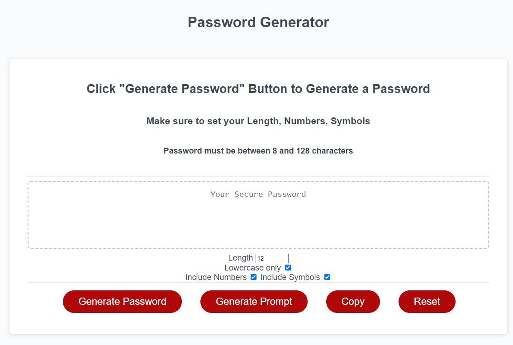

# Password Generator with Starter Code
## Description

Bootcamp: Module 3 Challenge  
Password Generator
Codebase correction that follows accessibility standards so that the site is optimized for search engines

## Table of Contents (Optional)

N/A

## Installation

Github pages hosting: https://fjnelson.github.io/Module3Challenge/

## Usage

## Credits

Starter code from: https://github.com/coding-boot-camp/friendly-parakeet  
Starter code belonging to Xandromus  
Date: March 15, 2020    
Password special characters: https://owasp.org/www-community/password-special-characters  

Heavily influenced solution from w3collective: https://github.com/w3collective/random-password-js and from Jamie Rachael: https://github.com/jamierachael/Password-Generator

## License

Please refer to the LICENSE in the repo.